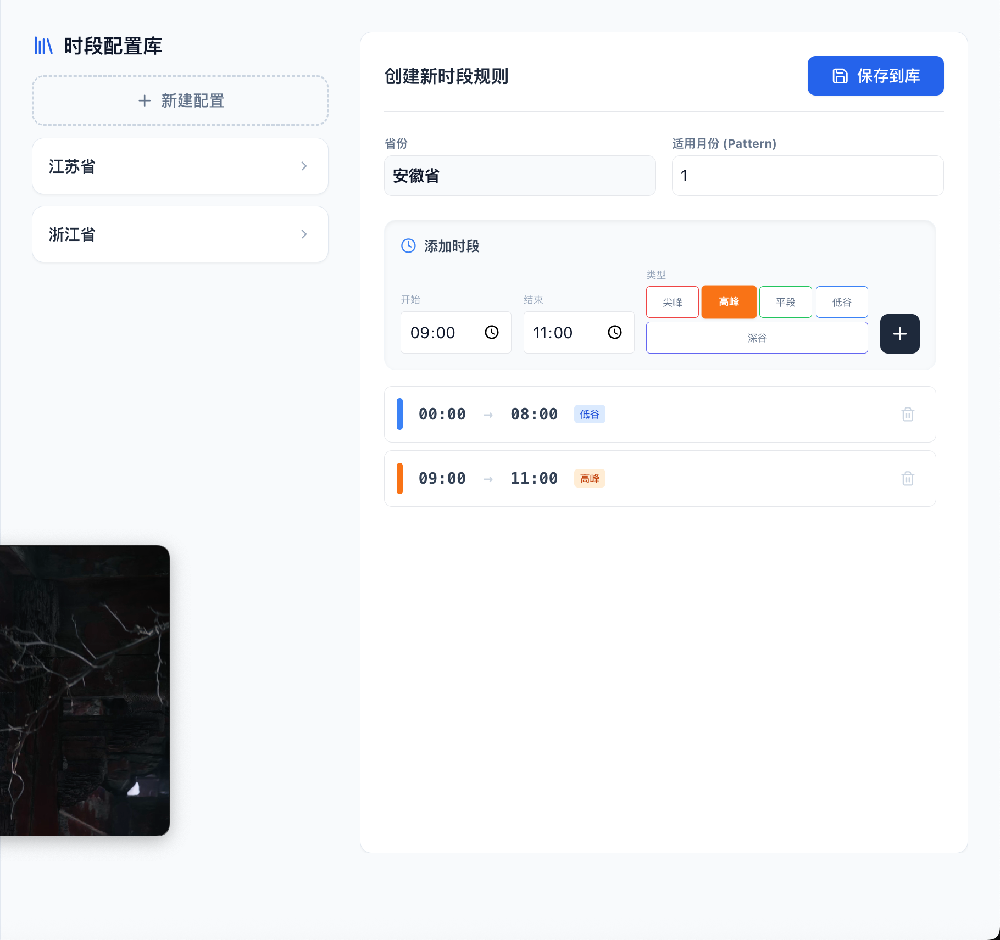
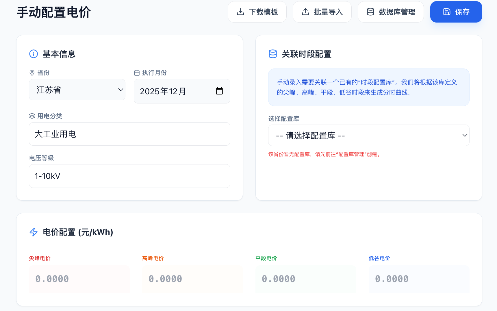

### 已解决
- [X] 智能录入功能问题：在导入图片识别后无法对各个时段的电价数值、类型等进行修改编辑、增删
- [X] 创建新时段规则页面问题：添加了时段后无法进行时段编辑，只能删除后重新添加，请改为选中时段后上方添加时段中的时间为选中时段的时间，即可重新配置并保存
- [x] 在时段配置库中新增一个时段配置后，原有配置消失了
- [x] 新配置的时段无法在手动录入页面中的关联时段配置中的下拉选择中显示，原有的时段配置也不见了
- [x] 时段配置库中的配置和手动时段配置中关联时段的配置还是不一致，请分析后解决
- [x] 手动配置电价页面中基本信息中省份下拉选择框中的内容是可手动配置或下拉推荐选择
- [x] 月综合电价计算页面中基础数据的省份选择也和数据库中省份数据不一致，请处理
- [x] 在地图页左侧添加一个浮动显示当前已有省份的列表，点击可以跳转到对应省份的电价页面
- [x] 在浮动省份列表对应省份右侧同步显示综合电价页面中计算的综合电价，此电价由综合电价页面的数据保存
- [x] 修复综合电价保存失败（Schema 校验及异步竞态问题）
- [x] 地图页布局重构：采用 Flexbox 左右分栏，彻底解决浮窗遮挡地图、高度不对齐及右侧空白问题
- [x] 优化地图页省份侧边栏宽度为 256px，移除冗余的收缩/展开按钮，提升界面整洁度

- [x] 优化 ManualEntry 配置关联逻辑：支持“全部（通用）”时段自动关联，修复空数据库时默认配置加载失败的问题。
- [x] 系统设置增加“恢复默认配置库”功能，增强数据容错能力。

### 未解决
暂无
